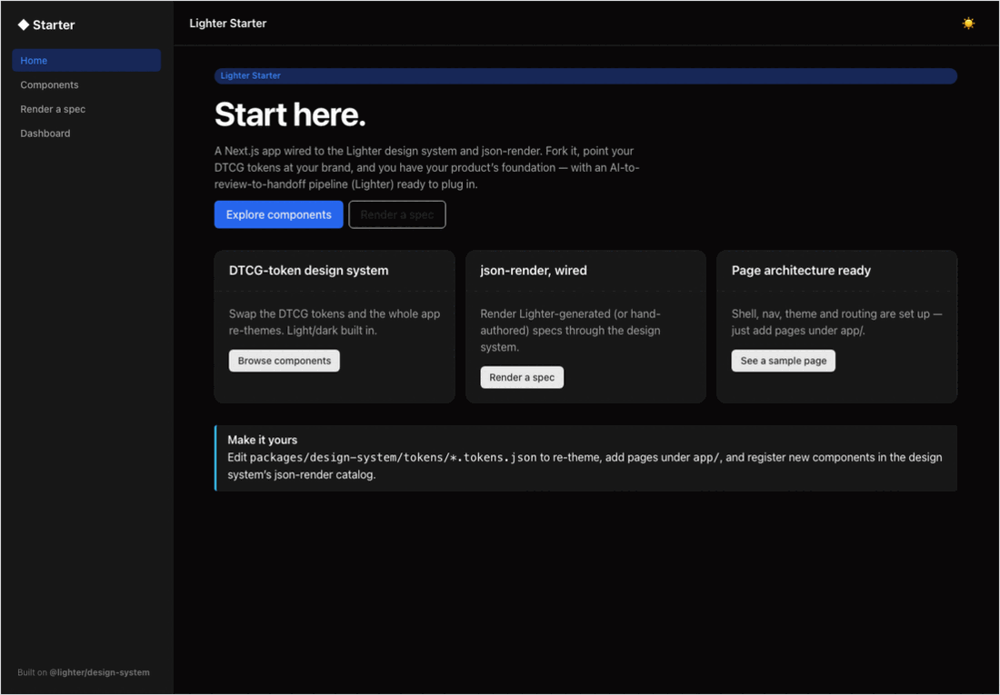

# @lighter/starter

A **Next.js (App Router) + json-render** starter app on the Lighter design system. **This is where a
consumer of Lighter starts** — the page architecture (theme, app shell, nav, routing) is already
wired, so you fork it, point your DTCG tokens at your brand, and build.



## Run it

```bash
pnpm install
pnpm --filter @lighter/starter dev     # http://localhost:4100
```

## What's wired

- **`app/layout.tsx`** — imports `@lighter/design-system/styles.css`, wraps the app in `<Providers>`
  (the design system's `ThemeProvider`, light/dark/system) and the `<AppShell>`.
- **`components/AppShell.tsx`** — sidebar nav + top bar + theme toggle. Add routes to `NAV`.
- **`app/page.tsx`** — home / landing.
- **`app/components/page.tsx`** — a live showcase of the design system (great as a visual test).
- **`app/render/page.tsx`** — the **json-render wrapper**: edit a Lighter internal spec and render it
  through the design system via `<SpecView>`. Paste a spec from Lighter's `GET /share/:token` or
  `POST /generate` and it renders.
- **`app/dashboard/page.tsx`** — a sample application page assembled from the design system.

## Make it your design system

Everything visual comes from DTCG tokens in `packages/design-system/tokens/`. Edit
`semantic.tokens.json` (or the primitives) and the whole app re-themes — no component changes. See
[`@lighter/design-system`](../../packages/design-system/README.md).

## Plug in the Lighter pipeline

The design system emits `dist/catalog.json` + `dist/tokens.json` (run
`pnpm --filter @lighter/design-system build`), which the Lighter API ingests (`POST /ingest`,
`artifactDir: "dist"`). From there: generate screens from intent, deploy to review links, collect
comments/approvals, and export a handoff bundle — all rendering through **this** design system. See
the repo [User Guide](../../docs/USER_GUIDE.md).
