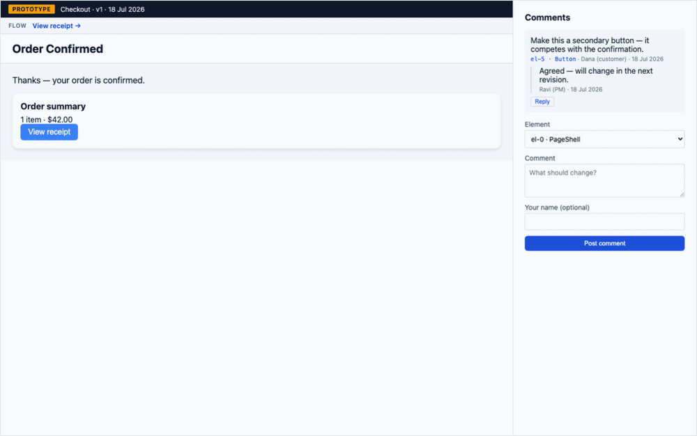

# Lighter — User Guide

Lighter turns a **design system** into an **AI-assisted design → review → hand-off pipeline**:

1. **Ingest** a design system (its components, prop schemas, and tokens).
2. **Author** screens — generate them from a plain-English intent (constrained to your components) or hand-write the spec.
3. **Deploy** a screen version to an unguessable, account-free **review link**.
4. **Review** — customers leave comments anchored to specific elements; threads, approvals, and sign-offs are tracked.
5. **Hand off** — export an approved version as a bundle an engineer can build from.



This guide walks the whole pipeline with real commands. It assumes the API is running on `http://localhost:3000` and (optionally) the web UI on `http://localhost:4000` — see [DEVELOPMENT.md](./DEVELOPMENT.md) to start them. Full endpoint reference: [API.md](./API.md).

---

## 1. Ingest a design system

Point Lighter at a design-system repo that has built artifacts (`dist/catalog.json` + `dist/tokens.json`):

```bash
curl -X POST localhost:3000/ingest -H 'content-type: application/json' \
  -d '{"repoPath":"/path/to/design-system","artifactDir":"dist"}'
```

The inventory (components, prop schemas, tokens, and health findings) is now queryable at `GET /inventory`, and the web dashboard (`/`, `/tokens`, `/health`, `/usage`) reflects it.

> **Auto-sync:** instead of running this by hand, wire the **push webhook** (§9) so a push to the design-system repo re-ingests automatically.

---

## 2. Author a screen

### a) Generate from intent (AI)

```bash
curl -X POST localhost:3000/generate -H 'content-type: application/json' \
  -d '{"intent":"An order-confirmed screen: a title, a summary card, and a Pay button."}'
```

The model is constrained to your catalog — the output is validated against every component's prop schema and retried on failure, so you never get a spec that references a component you don't have. Related: `POST /generate/variations` (N options side-by-side) and `POST /screens/:id/refine` (conversational edits).

> Generation calls the Anthropic API and needs a funded `ANTHROPIC_API_KEY`. If the key has no credit, the endpoint returns a clean `502 "spec generation failed"` (no upstream detail leaked) — the rest of the pipeline below works without it.

### b) Create a screen and save a version

Screens are versioned; every save is an immutable, git-committed version. Saving validates the spec against the ingested catalog:

```bash
curl -X POST localhost:3000/screens -H 'content-type: application/json' -d '{"name":"Checkout"}'

curl -X POST localhost:3000/screens/checkout/versions -H 'content-type: application/json' -d '{
  "spec": { "root": { "type":"PageShell", "props":{"title":"Order Confirmed"}, "children":[
    { "type":"Text", "props":{"content":"Thanks — your order is confirmed.","size":"lg"}, "children":[] },
    { "type":"Card", "props":{"title":"Order summary"}, "children":[
      { "type":"Text", "props":{"content":"1 item · $42.00","size":"md"}, "children":[] },
      { "type":"Button", "props":{"label":"View receipt","variant":"primary"}, "children":[] }
    ]}
  ]}}
}'
```

A spec that references an unknown component (or violates a prop schema) is rejected `400` with structured issues — the design system is the guardrail.

### c) Document intent (optional but recommended)

Attach an `INTENT.md` to the screen — purpose, flows, edge states, what's mocked. It travels with the screen and ships in the hand-off bundle:

```bash
curl -X PUT localhost:3000/screens/checkout/intent -H 'content-type: application/json' \
  -d '{"intent":"# Checkout\n\nPurpose: reassure the buyer the payment succeeded.\nFlow: cart → pay → this screen → receipt."}'
```

---

## 3. Deploy to a review link

```bash
curl -X POST localhost:3000/screens/checkout/versions/1/share \
  -H 'content-type: application/json' -d '{"expiresInSeconds":604800}'
# → { "token":"7fbf…", "expiresAt":"2026-07-25T…" }
```

- The **token** is the only credential — no account is needed to view.
- `expiresInSeconds` is optional; an expired (or unknown) token is refused.
- Deploying moves the version's approval state `draft → shared`.

Open the review surface at **`http://localhost:4000/share/<token>`**. It renders the mock live through the real design system, with a **prototype banner** (screen · version · deploy date) so a reviewer never mistakes it for production.

---

## 4. Review: element-anchored comments

A reviewer (no account) leaves a comment anchored to a specific element of the spec — anchored by the structural element id (`el-0`, `el-1`, …), so it survives layout changes:

```bash
curl -X POST localhost:3000/share/<token>/comments -H 'content-type: application/json' \
  -d '{"elementId":"el-5","body":"Make this a secondary button.","author":"Dana (customer)"}'
```

Reply to build a thread (a reply inherits its parent's element):

```bash
curl -X POST localhost:3000/share/<token>/comments -H 'content-type: application/json' \
  -d '{"parentId":1,"body":"Agreed — will change next revision.","author":"Ravi (PM)"}'
```

The PM sees everything grouped by version → element, with thread contents:

```bash
curl localhost:3000/screens/checkout/comments
```

The comments can be fed back into the next AI refinement (`POST /screens/:id/refine` folds them into the prompt, anchored to their element ids), closing the review → regenerate loop.

---

## 5. Approve — with sign-off enforcement

Each version has an approval lifecycle: `draft → shared → changes-requested → approved`.

```bash
curl -X POST localhost:3000/screens/checkout/versions/1/request-changes   # shared → changes-requested
curl -X POST localhost:3000/screens/checkout/versions/1/approve           # → approved
curl localhost:3000/screens/checkout/versions/1/status                    # { state: "approved" }
```

To require **sign-off** before approval, configure a set (at least one customer and one internal owner):

```bash
curl -X PUT localhost:3000/screens/checkout/sign-off-set -H 'content-type: application/json' \
  -d '{"parties":[{"party":"acme-co","role":"customer"},{"party":"design-lead","role":"internal"}]}'
```

Now `approve` is **blocked (409)** until every party has signed:

```bash
curl -X POST localhost:3000/screens/checkout/versions/1/sign-offs -d '{"party":"acme-co"}' -H 'content-type: application/json'
curl -X POST localhost:3000/screens/checkout/versions/1/sign-offs -d '{"party":"design-lead"}' -H 'content-type: application/json'
curl -X POST localhost:3000/screens/checkout/versions/1/approve   # now succeeds
```

Comment and approval events emit **notifications** to a configured webhook (`NOTIFY_WEBHOOK_URL`) so the team doesn't poll.

---

## 6. Hand off an approved version

Export a bundle with everything an engineer needs — allowed **only for an approved version**:

```bash
curl localhost:3000/screens/checkout/versions/1/export
```

```jsonc
{
  "screen": { "id": "checkout", "name": "Checkout" },
  "version": 1,
  "spec": {/* the approved internal spec */},
  "catalogPrompt": "### Button\n…", // deterministic machine-readable catalog
  "tokens": [/* the design system's tokens */],
  "intent": "# Checkout\n…", // the screen's INTENT.md
  "reactExport": "import { SpecView } from 'lighter-example/ui';\n…", // a standalone .tsx
}
```

The `reactExport` is a runnable `.tsx` that embeds the spec and renders it via the design system — drop it into a project that has the design system and it renders the approved screen. Exporting a non-approved version returns `403` with the current state.

---

## 7. Click-through flows

Connect screens into a journey so reviewers can click through, not just view single screens:

```bash
curl -X PUT localhost:3000/screens/checkout/flow -H 'content-type: application/json' \
  -d '{"links":[{"label":"View receipt","target":"receipt"}]}'
```

The deployed mock shows a **Flow** bar; each link goes to the target screen's current deployed mock (or renders disabled if that screen isn't deployed yet).

---

## 8. Freshness: stale-spec flagging

When the design system changes underneath saved specs, `GET /specs` flags any spec that references a removed or renamed component:

```bash
curl localhost:3000/specs
# [{ "screen":"Checkout", "version":"v1", "components":[…], "stale":false, "staleComponents":[] }]
```

---

## 9. Auto re-ingest on push

Configure `DESIGN_SYSTEM_REPO` + `WEBHOOK_SECRET`, then have your CI deliver a signed webhook on push:

```bash
BODY='{"after":"<commit-sha>"}'
SIG="sha256=$(printf '%s' "$BODY" | openssl dgst -sha256 -hmac "$WEBHOOK_SECRET" | sed 's/^.*= //')"
curl -X POST localhost:3000/webhooks/design-system \
  -H "x-hub-signature-256: $SIG" -H 'content-type: application/json' -d "$BODY"
```

Re-ingestion is **idempotent per commit** (a re-delivery is a no-op) and requires a valid HMAC signature (unsigned requests are refused `401`).

---

## The pipeline at a glance

```
ingest ─► author (generate│hand-write) ─► deploy (token, expiry)
                                              │
                        ┌─────────────────────┴─────────────────────┐
                        ▼                                            ▼
                 review: comments,                          click-through flows
                 threads, aggregation
                        │
                        ▼
             refine (comments → prompt) ─► approve (state machine + sign-off)
                        │
                        ▼
                 export handoff bundle  (spec · catalog prompt · tokens · INTENT.md · React)
```
